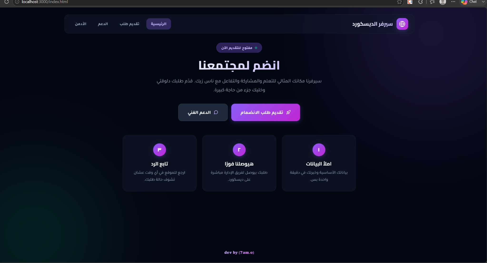
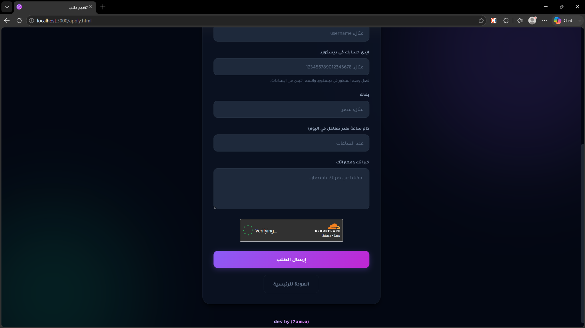
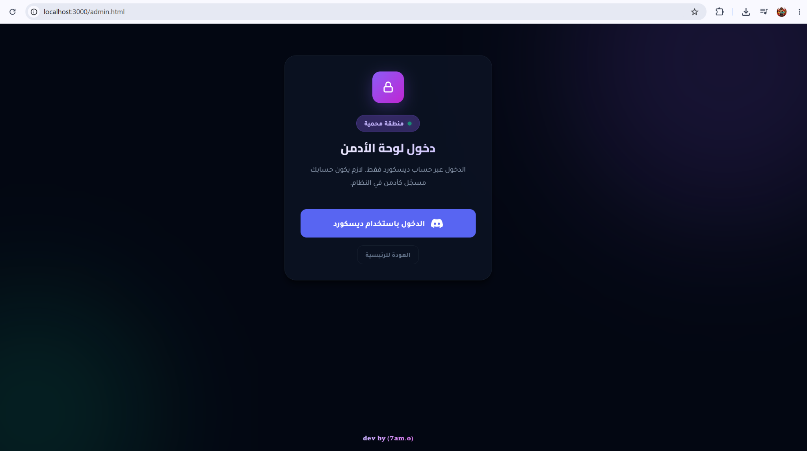
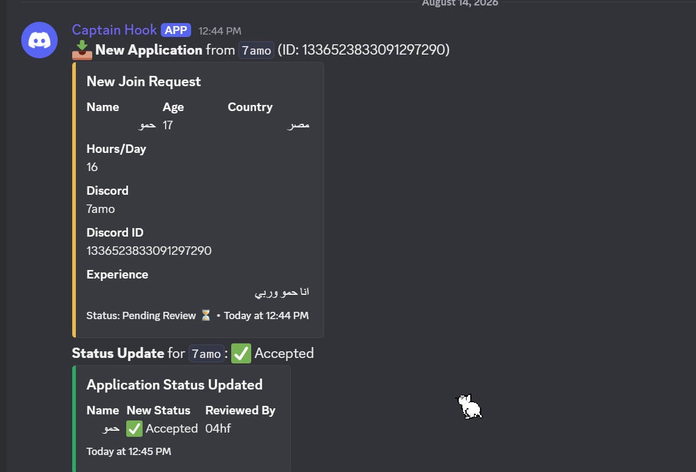

<div dir="rtl">

# نظام تقديم Discord

نظام متكامل لاستقبال طلبات الانضمام وإدارتها من خلال لوحة تحكم، مع تسجيل دخول Discord، حماية Cloudflare Turnstile، قاعدة بيانات SQLite، وإشعارات مباشرة إلى Discord.

الفكرة ببساطة: بدل ما تجمع الطلبات يدويًا وتراجعها من أكثر من مكان، النظام يجمع كل شيء في مكان واحد — المستخدم يقدّم، الطلب يتخزن، الإدارة تراجعه، والنتيجة تتسجل وتوصل للإدارة على Discord.

---

## المحتويات

- [عن المشروع](#عن-المشروع)
- [المميزات](#المميزات)
- [الصور](#الصور)
- [التقنيات](#التقنيات)
- [متطلبات التشغيل](#متطلبات-التشغيل)
- [التثبيت](#التثبيت)
- [إعداد ملف البيئة](#إعداد-ملف-البيئة)
- [إعداد Discord](#إعداد-discord)
- [إعداد Cloudflare Turnstile](#إعداد-cloudflare-turnstile)
- [قاعدة البيانات](#قاعدة-البيانات)
- [التشغيل](#التشغيل)
- [هيكل المشروع](#هيكل-المشروع)
- [الأمان](#الأمان)
- [أوامر سريعة](#أوامر-سريعة)
- [ملاحظات مهمة](#ملاحظات-مهمة)
- [المساهمة](#المساهمة)
- [الترخيص](#الترخيص)

---

## عن المشروع

المشروع معمول كسستم تقديم جاهز وقابل للتخصيص لسيرفرات Discord.

الهدف الأساسي هو توفير تجربة مرتبة للطرفين:

**للمتقدم:**
- نموذج واضح وسهل.
- حماية من البوتات والطلبات المزعجة.
- متابعة حالة الطلب.

**للإدارة:**
- لوحة تحكم خاصة.
- مراجعة الطلبات من مكان واحد.
- قبول أو رفض الطلبات.
- إحصائيات وفلترة.
- إشعارات مباشرة داخل Discord.

المشروع يعتمد على إعدادات `.env`، لذلك تقدر توزع نفس الكود على أكثر من سيرفر، وكل شخص يستخدم مفاتيحه وإعداداته الخاصة بدون تعديل الـ Core Code.

---

## المميزات

### نظام التقديم

- نموذج تقديم عربي ومتجاوب.
- التحقق من البيانات قبل الحفظ.
- تخزين الطلبات في قاعدة البيانات.
- منع التقديم المتكرر حسب إعدادات النظام.
- حالات واضحة للطلب:
  - قيد المراجعة
  - مقبول
  - مرفوض

### لوحة الإدارة

- تسجيل دخول باستخدام Discord.
- تحديد حسابات الإدارة عن طريق Discord ID.
- عرض ومراجعة الطلبات.
- البحث والفلترة.
- متابعة حالة كل طلب.
- إحصائيات للطلبات.
- تصدير البيانات بصيغة CSV.

### Discord

- تسجيل دخول Discord OAuth2.
- إرسال الطلبات إلى Webhook.
- إرسال تحديثات حالة الطلب.
- عرض بيانات المتقدم بشكل مرتب داخل Discord.

### الحماية

- Cloudflare Turnstile.
- CSRF Protection.
- Rate Limiting.
- Helmet Security Headers.
- Sessions آمنة.
- Server-side Validation.
- التحقق من البيانات على السيرفر.

---

## الصور

### الصفحة الرئيسية

واجهة تعريفية بسيطة توضّح فكرة النظام وتوجّه المستخدم للتقديم أو الدعم.



### نموذج التقديم

نموذج تقديم كامل مع Cloudflare Turnstile قبل إرسال الطلب.



### لوحة دخول الإدارة

صفحة مخصصة لدخول الإدارة باستخدام Discord.



### إشعارات Discord

عند وصول طلب جديد يتم إرسال بياناته إلى Discord، مع تحديث منفصل عند تغيير حالة الطلب.



---

## التقنيات

| التقنية | الاستخدام |
|---|---|
| Node.js | تشغيل السيرفر |
| Express | الـ Backend والـ API |
| Prisma | إدارة قاعدة البيانات |
| SQLite | قاعدة البيانات المحلية |
| Discord OAuth2 | تسجيل الدخول |
| Cloudflare Turnstile | حماية النماذج |
| HTML / CSS / JavaScript | الواجهة |
| Webhook | إشعارات Discord |

---

## متطلبات التشغيل

قبل التشغيل تحتاج:

- Node.js 18 أو أحدث.
- npm.
- Discord Application.
- حساب Cloudflare لاستخدام Turnstile.

> لا تحتاج MongoDB أو PostgreSQL. المشروع يستخدم SQLite محليًا.

---

## التثبيت

### 1. تحميل المشروع

```bash
git clone https://github.com/hamdyfouad495-cloud/apply-html.git
cd apply-html
```

### 2. تثبيت المكتبات

```bash
npm install
```

### 3. إنشاء ملف `.env`

انسخ:

```text
.env.example
```

إلى:

```text
.env
```

على Windows:

```bash
copy .env.example .env
```

---

## إعداد ملف البيئة

افتح `.env` وحط بياناتك:

```env
DATABASE_URL="file:./dev.db"

DISCORD_CLIENT_ID=
DISCORD_CLIENT_SECRET=
DISCORD_CALLBACK_URL=

TURNSTILE_SITE_KEY=
TURNSTILE_SECRET_KEY=

SESSION_SECRET=
ADMIN_DISCORD_IDS=

DISCORD_WEBHOOK_URL=

PORT=3000
NODE_ENV=development
```

### شرح الإعدادات

| المتغير | وظيفته |
|---|---|
| `DATABASE_URL` | مكان قاعدة SQLite |
| `DISCORD_CLIENT_ID` | Client ID الخاص بتطبيق Discord |
| `DISCORD_CLIENT_SECRET` | Client Secret الخاص بـ Discord |
| `DISCORD_CALLBACK_URL` | رابط الرجوع بعد تسجيل الدخول |
| `TURNSTILE_SITE_KEY` | المفتاح العام لـ Turnstile |
| `TURNSTILE_SECRET_KEY` | المفتاح السري للتحقق |
| `SESSION_SECRET` | مفتاح حماية الجلسات |
| `ADMIN_DISCORD_IDS` | Discord IDs الخاصة بالإدارة |
| `DISCORD_WEBHOOK_URL` | Webhook استقبال الإشعارات |
| `PORT` | منفذ تشغيل السيرفر |
| `NODE_ENV` | بيئة التشغيل |

---

## إعداد Discord

من Discord Developer Portal:

1. أنشئ Application جديدة.
2. ادخل على **OAuth2**.
3. أضف Redirect URL:

```text
http://localhost:3000/api/auth/discord/callback
```

4. انسخ:
   - Client ID
   - Client Secret

وحطهم في `.env`:

```env
DISCORD_CLIENT_ID=ضع_الـ_Client_ID_هنا
DISCORD_CLIENT_SECRET=ضع_الـ_Client_Secret_هنا
DISCORD_CALLBACK_URL=http://localhost:3000/api/auth/discord/callback
```

### تحديد الإدارة

ضع Discord ID الخاص بالأدمن:

```env
ADMIN_DISCORD_IDS=123456789012345678
```

ولو أكثر من أدمن:

```env
ADMIN_DISCORD_IDS=123456789012345678,987654321098765432
```

---

## إعداد Cloudflare Turnstile

Turnstile مسؤول عن التحقق أن الطلب جاي من مستخدم حقيقي وليس Bot.

### الحصول على `TURNSTILE_SITE_KEY`

1. افتح Cloudflare Dashboard.
2. ادخل على **Turnstile**.
3. اختر **Add widget**.
4. اختر **Managed**.
5. في **Hostname Management** أضف الدومين المستخدم.
6. أثناء التجربة المحلية أضف:

```text
localhost
127.0.0.1
```

7. أنشئ الـ Widget.
8. انسخ **Site Key**.

ثم:

```env
TURNSTILE_SITE_KEY=ضع_الـ_Site_Key_هنا
```

### الحصول على `TURNSTILE_SECRET_KEY`

من نفس الـ Widget:

1. افتح إعدادات الـ Widget.
2. ابحث عن **Secret Key**.
3. انسخه.
4. ضعه في `.env`:

```env
TURNSTILE_SECRET_KEY=ضع_الـ_Secret_Key_هنا
```

### مهم جدًا

`TURNSTILE_SITE_KEY` ممكن يظهر في الـ Frontend.

لكن:

`TURNSTILE_SECRET_KEY`

**لازم يفضل على السيرفر فقط** وممنوع يتحط داخل HTML أو JavaScript أو GitHub.

ولو بتوزع المشروع على ناس مختلفة، كل شخص يعمل Widget خاص بيه ويحط المفاتيح في `.env` بتاعه.

---

## قاعدة البيانات

المشروع يستخدم:

```text
SQLite + Prisma
```

بعد ضبط `.env` شغّل:

```bash
npx prisma generate
```

وبعدها:

```bash
npx prisma db push
```

لفتح Prisma Studio:

```bash
npx prisma studio
```

---

## التشغيل

شغل المشروع:

```bash
npm start
```

بعدها افتح:

```text
http://localhost:3000
```

صفحة التقديم:

```text
http://localhost:3000/apply.html
```

لوحة الإدارة:

```text
http://localhost:3000/admin.html
```

---

## هيكل المشروع

```text
apply-html/
│
├── prisma/
│   └── schema.prisma
│
├── public/
│   ├── index.html
│   ├── apply.html
│   ├── apply.js
│   ├── admin.html
│   ├── admin.js
│   ├── support.html
│   ├── 404.html
│   ├── style.css
│   └── favicon.svg
│
├── .env.example
├── .gitignore
├── package.json
├── package-lock.json
└── server.js
```

---

## الأمان

المشروع يعتمد على الحماية من أكثر من طبقة، وليس على الـ Frontend فقط.

من أهم الطبقات:

```text
Cloudflare Turnstile
CSRF Protection
Rate Limiting
Helmet
Discord OAuth2
Session Authentication
Server-side Validation
```

### ممنوع رفع الأسرار إلى GitHub

لا ترفع:

```text
.env
*.db
```

ولا تشارك:

```text
DISCORD_CLIENT_SECRET
TURNSTILE_SECRET_KEY
SESSION_SECRET
DISCORD_WEBHOOK_URL
```

استخدم `.env.example` كقالب فقط.

---

## أوامر سريعة

### تثبيت

```bash
npm install
```

### تشغيل

```bash
npm start
```

### إنشاء Prisma Client

```bash
npx prisma generate
```

### تحديث قاعدة البيانات

```bash
npx prisma db push
```

### فتح Prisma Studio

```bash
npx prisma studio
```

---

## ملاحظات مهمة

- كل نسخة من المشروع المفروض يكون لها `.env` خاص بيها.
- لا تحط مفاتيح Discord أو Turnstile داخل الكود.
- لو نقلت المشروع إلى دومين حقيقي، غيّر `DISCORD_CALLBACK_URL`.
- أضف الدومين الجديد داخل Cloudflare Turnstile.
- قاعدة SQLite مناسبة للتشغيل البسيط والمحلي، لكن لو المشروع هيكبر جدًا أو هيشتغل على أكثر من سيرفر في نفس الوقت، يفضل إعادة تقييم نوع قاعدة البيانات.

---

## المساهمة

لو عندك تحسين أو إصلاح للمشروع:

1. اعمل Fork.
2. اعمل Branch جديد.
3. نفذ التعديل.
4. اعمل Commit واضح.
5. افتح Pull Request.

---

## الترخيص

MIT License

---

## المطور

**7am.o**

</div>
